# Chapter 03 Labs

You will need to do some research and find the download links for the Linux and BSD based distros below and install them in VirtualBox.  Complete each install to disk.  Assume each instance listed below is 64-bit version. Take a screen shot of each desktop after logging in.

* Debian Based
  * Ubuntu 20.04 Desktop edition
  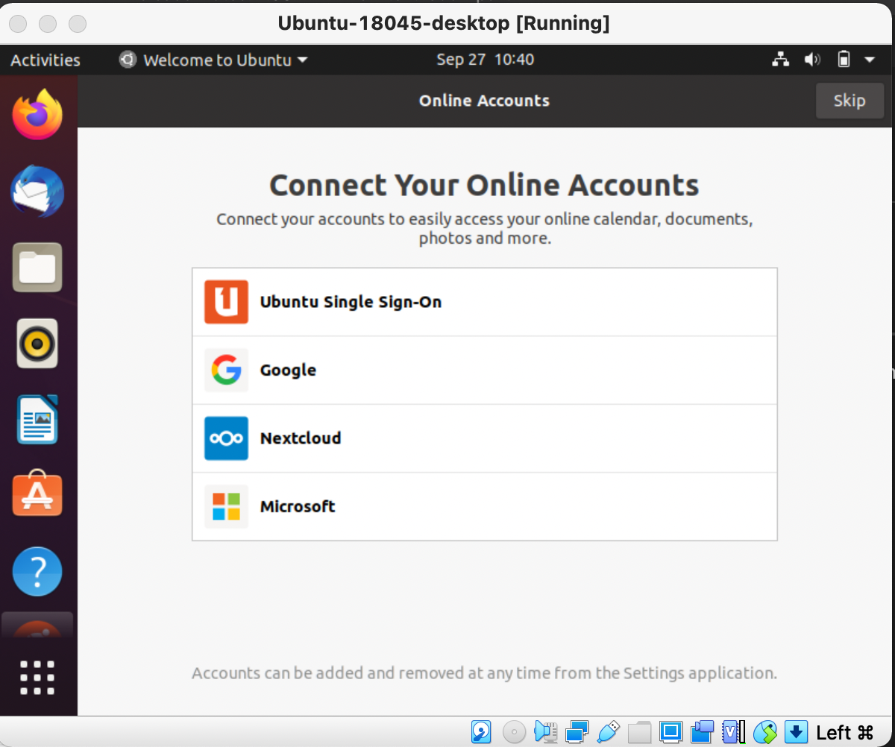
  * Lubuntu 20.04 Desktop edition
  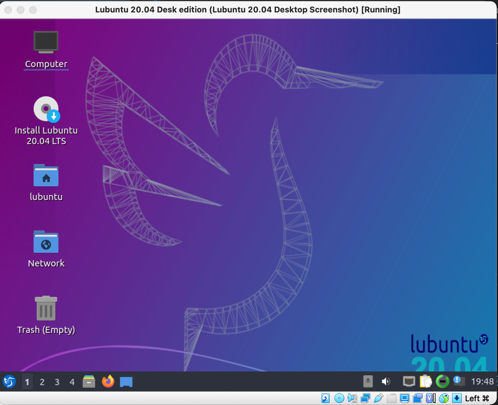
  * Ubuntu 20.04 Server edition
  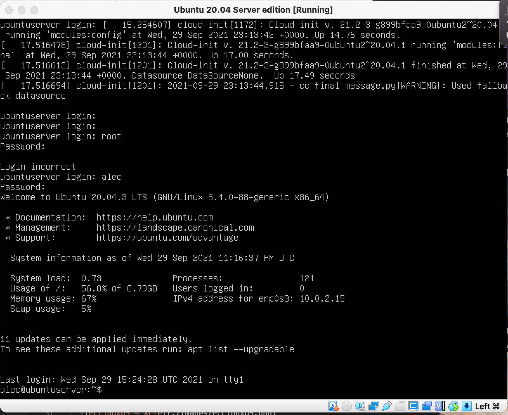
  * Trisquel Linux
  
  * Solus Linux - MATE
  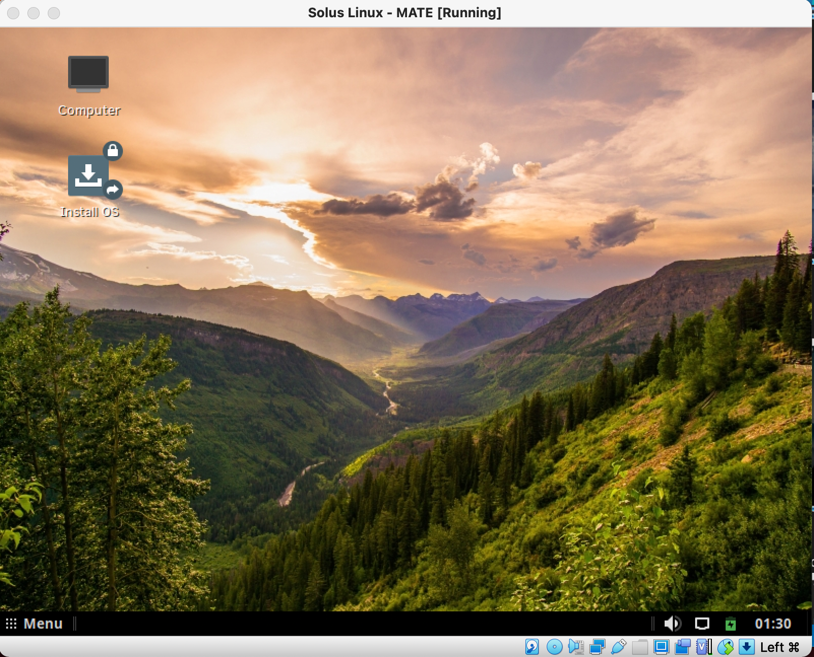
  * PureOS
  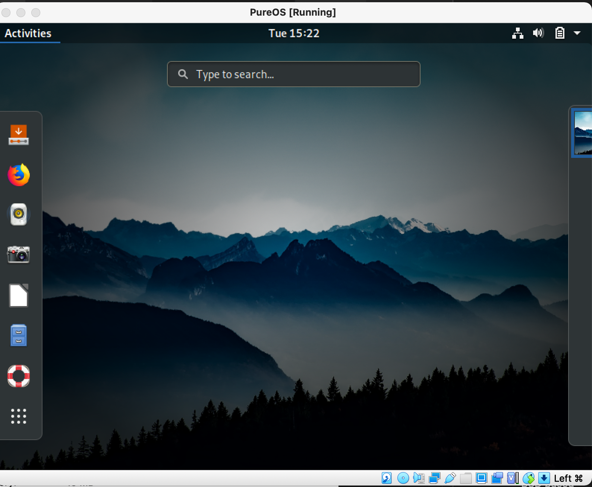

* Red Hat Based
  * Fedora 34 - Workstation edition
  
  * CentOS 8 Stream - Minimal install
  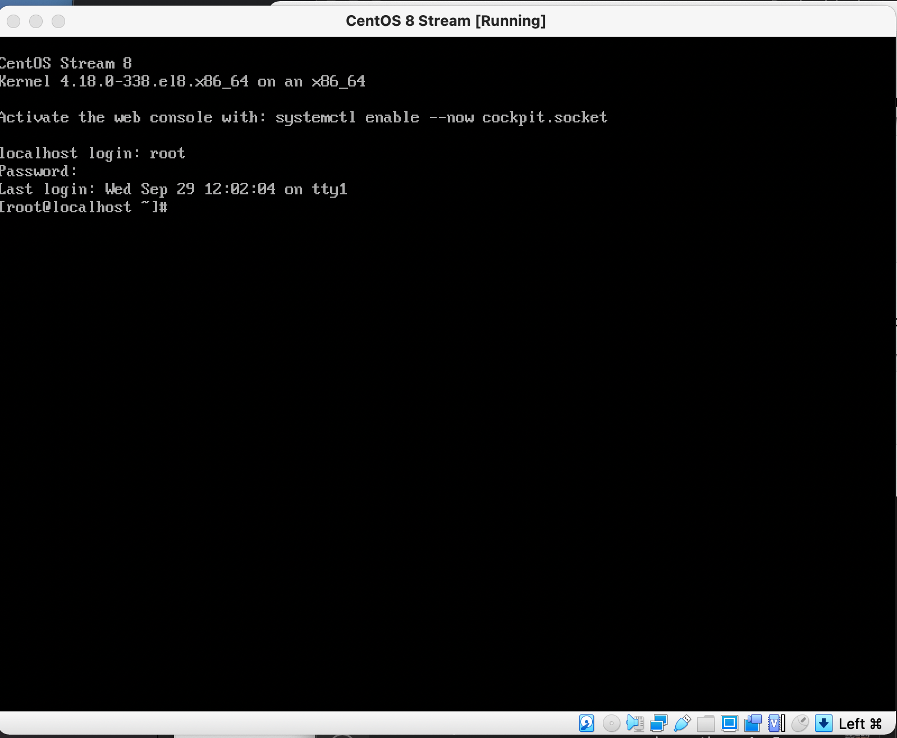

* Illumos Based
  * OmniOS Community Edition

* BSD based
  * FreeBSD

* Linux
  * Alpine Linux - Standard
  
  * MX Linux
  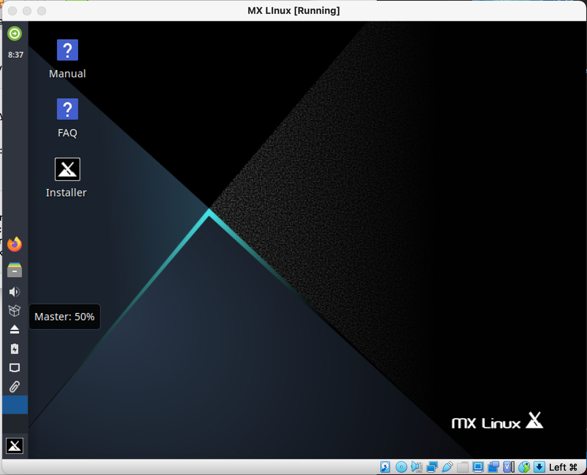
  * PCLinuxOS - Xfce mini
  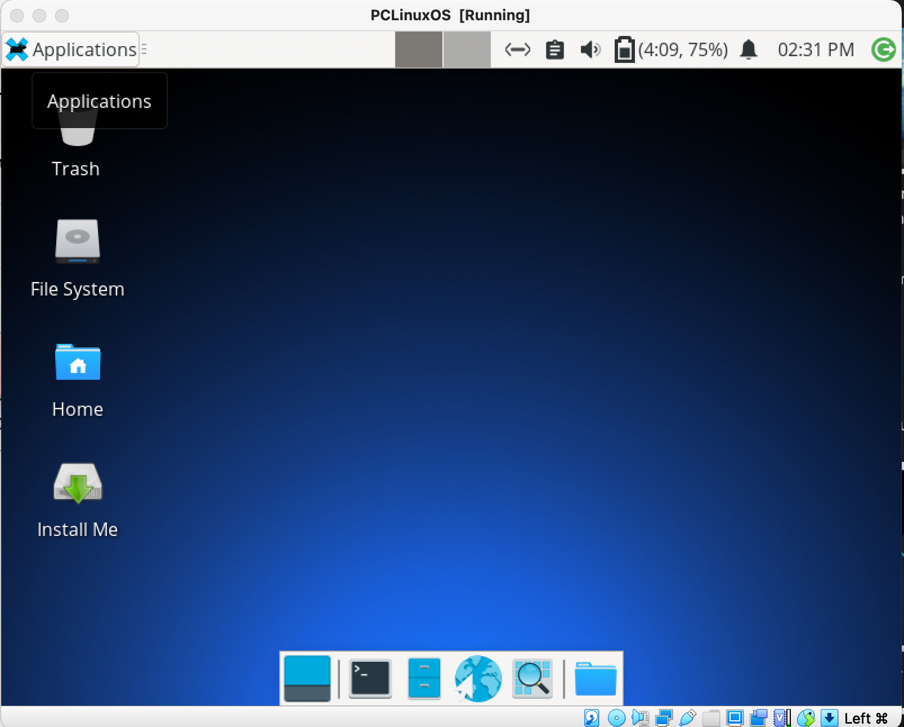
  * Linux Mint
  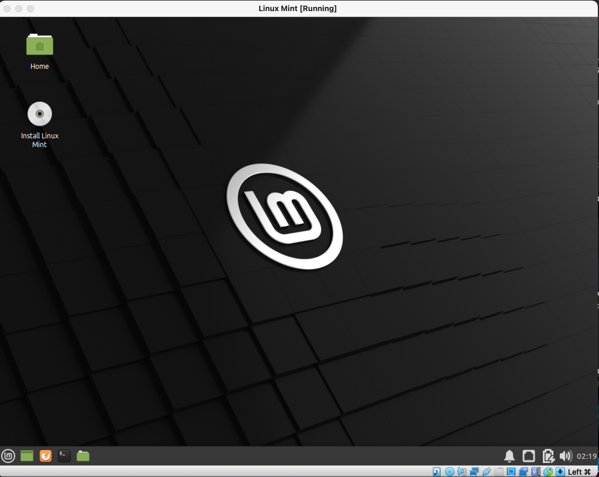

* Network Based Install
  * openSUSE Leap
  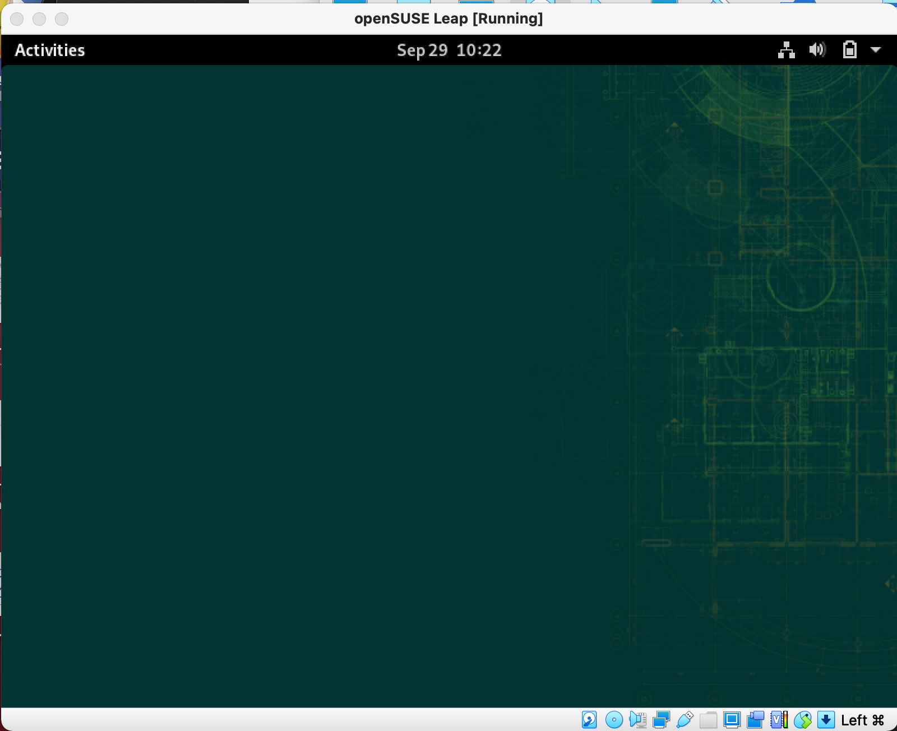
  * Debian 11.x
  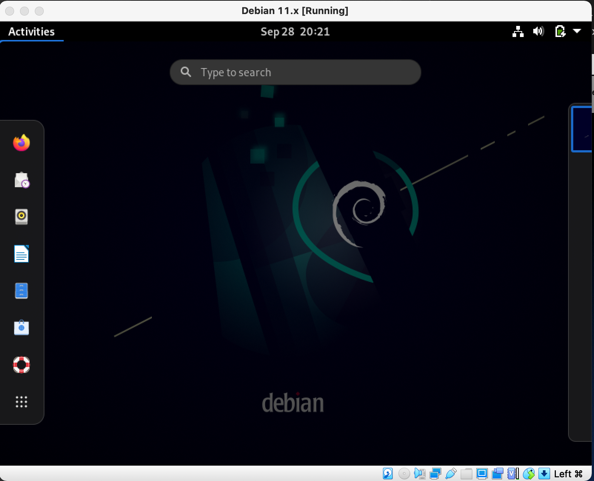


## Python pyttsx3

Install these pre-requisites needed for the speech-to-text library. You will also need to install Python3 dependencies to use pip

```bash
sudo apt-get install python3-dev python3-setuptools python3-pip libespeak1 libespeak1-dev
```

Then use Python3 pip installer to install the Python3 Speech-to-Text library:

```bash
python3 -m pip install pyttsx3
```

To test this create a file named `py-speech.py` using a Text Editor, Visual Studio Code, or a similar application with this content:

```python
import pyttsx3
engine = pyttsx3.init()
engine.say("I will speak this text")
engine.runAndWait()
```

Upon saving this file, from the commandline, execute this code with the command: `python3 py-speech.py` and if you hear the computer voice you will have successfully installed the modules via Python3.
