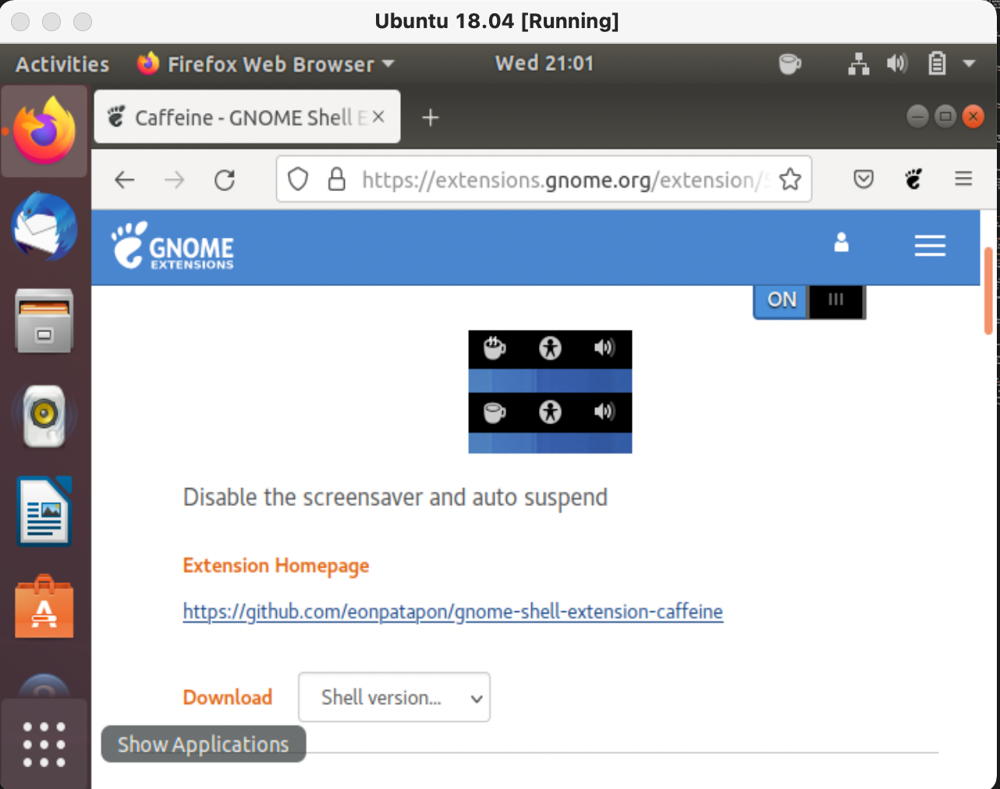
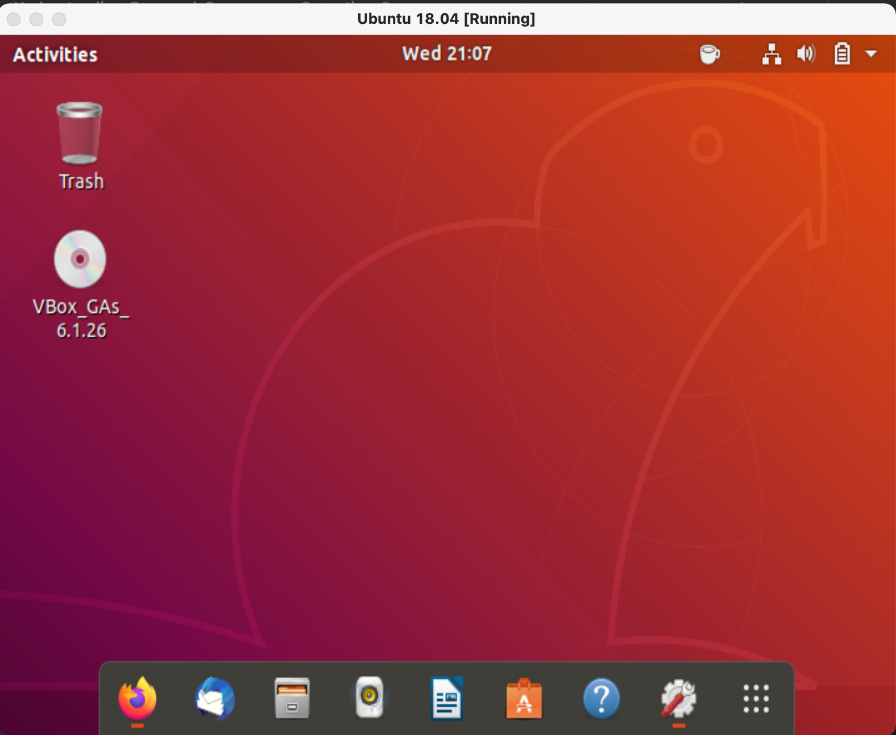

# Labs - Chapter 04

Using the virtual machines you installed in the previous chapter, you will now install additional software, themes, desktop environments, and window managers. You will combine screenshots of this newly installed software into a single document for submission.

## Package based install

## GNOME 3 Extensions

You will need to install the list of GNOME 3 extensions from [https://extensions.gnome.org](https://extensions.gnome.org "Gnome extensions").  The first one is the example in the book called *Caffeine*. Make sure you have the Gnome Shell integration installed to configure and install plugins directly from the browser.

1) Caffeine

1) Dash to Dock

1) Screenshot Tool

## Snaps Install

To install and configure snaps, reference chapter 3.  To show these packages are installed take a screenshot of the output of the command: `sudo snap list`. Install these packages via Snap on Ubuntu 18.04 desktop:

1) Android Studio
1) Blender
1) Slack
1) Skype
1) Visual Studio Code

## Flatpak Install

To install and configure flatpak and flathub, reference chapter 3.  To show these packages are installed take a screenshot of the output of the command: `sudo flatpak list`. Install these packages via flatpak on the Fedora virtual machine:

1) Kdenlive
1) Visual Studio Code
1) Discord
1) Remmina
1) GtkStressTesting

## Ubuntu 18.04 Flatpak Install

To install and configure flatpak and flathub, reference chapter 3.  To show these packages are installed take a screenshot of the output of the command: `sudo flatpak list`. Install these packages via flatpak:

1) Microsoft Teams
1) Shotcut
1) LibrePCB
1) OpenBoard

## AppImage Install

Find 3 [AppImage install packages](https://appimage.org/ "AppImages install"), follow the instructions to install and run these AppImages on both Ubuntu 18.04 and Fedora 32.  Take a screenshot of the command needed to run the AppImage and the corresponding first screen of that application from the [AppImage GitHub repo](https://appimage.github.io/apps "AppImage GitHub Repo").

1) Poddr
1) Archipelago
1) LibrePCB

## Python

From Chapter 3, you need to install software packages using the Python pip installer and the Rust Language using their cargo package manager.

You can see an example of how to install Python language packages (eggs). Drone kit is an API for controlling [3D Robotics](https://www.3drobotics.com "drones") drones located at [dronekit.io](http://dronekit.io "drone kit").  To [install their Python development packages](http://python.dronekit.io/guide/quick_start.html#installation "Python packages") you need to use ```pip``` the Python Package Installer.

```sudo apt-get install python-pip python-dev```

```bash
sudo pip install dronekit
sudo pip install dronekit-sitl
```

From the command line, run the ```dronekit-sitl --version``` command and take a screenshot of the output.

Using the the ```pip``` command install the Image editor Pillow, [https://pillow.readthedocs.io/en/latest/handbook/index.html](https://pillow.readthedocs.io/en/latest/handbook/index.html "Pillow pip page")

## Rust Packages

Using [Rust](https://www.rust-lang.org/ "Rust-lang"), follow the install instructions to install a Rust based version of the GNU coretools. Follow the tutorial to help you download and compile these tools with Rust, [https://github.com/uutils/coreutils](https://github.com/uutils/coreutils "Build Core-utils"); use the ```cargo build``` and ```cargo install``` commands. This will compile Rust based versions of all of the GNU C based coreutils.

To install the Rust-lang ```curl https://sh.rustup.rs -sSf | sh```

Run the command `base64 --version` and then ```uniq --version``` and take a screenshot of the GNU output.  
run the command `~/.cargo/bin/coreutils/base64 --version` and then `~/.cargo/bin/coreutils/uniq --version` and take a screenshot of the Rust based Coretools output.

## Installing Window Managers

You will chose 1 of the window managers from the categories listed earlier in the chapter and install them.  Once installed you need to log out and restart your session.  In order to change the default window manager on GNOME3 desktop environment you need to click on the user name and select the little gear below the password field.  In your screenshot open a terminal window, you might need to do some research to understand how to operate in a window manager.


1) Compositing window manager
1) Stacking window manager
1) Tiling window manager
1) Install Enlightenment (E17) on Ubuntu 18.04

**Note:** the names of packages are not always obvious so you can use search features of package managers.  For example here would be how to search for the i3 package.

* ```sudo apt-cache search i3```
* ```sudo dnf search i3```

## Desktop Environment Installs

Install these desktops, restart your system and as you login switch your desktop environment and take a screenshot of the new environment.

1) Install the Xfce Desktop on Fedora 32
1) Install the Ubuntu Mate Desktop on Ubuntu 18.04
1) Install the Xfce4 Desktop on Ubuntu 18.04 (not xubuntu-desktop but just xfce4 package)
1) Download the KDE Neon Desktop distro (Ubuntu based) from [https://neon.kde.org/download](https://neon.kde.org/download "KDE desktop Neon")

## Ubuntu Theme Tweaking

We will use the tutorial at Noobslab to transform our Ubuntu 18.04 Desktop into a MacBuntu.
Following the instructions here: [http://www.noobslab.com/2018/08/macbuntu-1804-transformation-pack-ready.html](http://www.noobslab.com/2018/08/macbuntu-1804-transformation-pack-ready.html "macbuntu")

The *Tweak tool* referred in the tutorial is the GNOME tweak tool:


**Deliverable:** Take screenshots of all successful installs of software.  See Blackboard for submission details.
